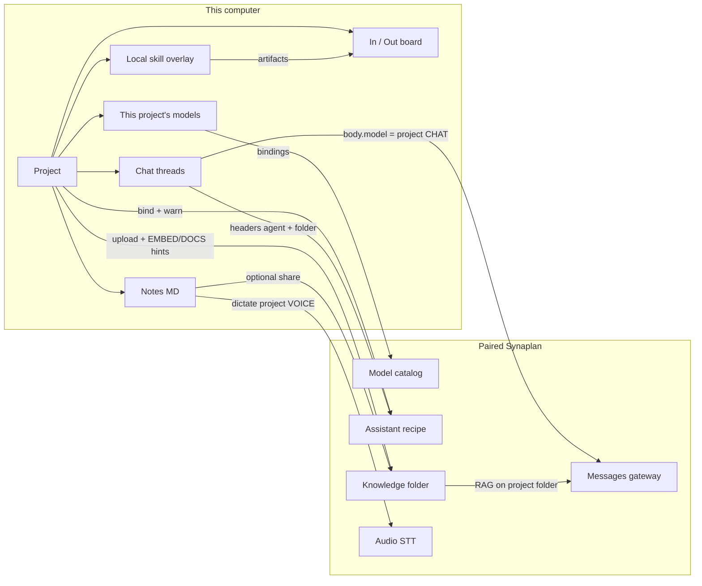

# Synaplan Desktop — project companion master plan

**Status:** Draft 2026-09-10. Do not start product code until every row
in §0 is agreed. If a row is rejected, update this file in the same
change as the alternative.
**Owner surface:** the existing Synaplan Desktop window. Pairing stays
the only screen when unpaired. No new Synaplan web route is required
for v1 of this epic.
**Platforms:** Windows, macOS, and Linux remain **all Tier 1**. Platform
rules in
[`../20260829-desktop-agent-client/13_cross_platform.md`](../20260829-desktop-agent-client/13_cross_platform.md)
still bind every `PC*` step.
**Related:**

- [`../20260829-desktop-agent-client/00_master_plan.md`](../20260829-desktop-agent-client/00_master_plan.md)
  — frozen Phase A/B: pairing, scopes, `protocol: 1`, confinement, no
  shell, secret store, `app_dirs`
- [`docs/DESKTOP.md`](/wwwroot/synaplan/docs/DESKTOP.md) — shipped
  desktop contract (extend, do not fork)
- [`02_sovereign_models.md`](./02_sovereign_models.md) — per-project
  model matrix (binding)
- sani-sis `DiktatKnopf.vue` + `synaplan.rs` — dictation reference
  (copy the protocol, not the care-service prompt)

Sprint files and the binding test contract live beside this file.
Implement from [`10_work_breakdown.md`](./10_work_breakdown.md).

---

## 0. Decision checklist (tick before any code)

| # | Decision | Proposed default | Agree? |
| - | -------- | ---------------- | ------ |
| 1 | **Local-first Project.** Metadata, notes, and chats live on this computer. There is no server Project entity and no cross-device note sync in this epic. | Locked | |
| 2 | **Knowledge folder on Synaplan.** Uploaded project files use `group_key` `DESKTOP:{projectId}` and `process_level=vectorize`. The UI says **Knowledge folder**, never `group_key`. | Locked | |
| 3 | **Assistant vs Skill.** UI **Assistant** = server recipe (Synaplan Agents). UI **Skill** = local `SKILL.md` folder. Skill stays untranslated. | Locked | |
| 4 | **Frozen contract.** `protocol: 1` unchanged. No shell. Secret store unchanged. Existing `app_dirs` identifiers unchanged (bundle id, vendor path, config / skills / out-box / audit). | Locked | |
| 5 | **`projects_dir` only.** Add `~/Synaplan/projects/{slug}/` next to the out-box. The field is added **only** in `platform/app_dirs.rs`. | Locked | |
| 6 | **No re-pair.** Existing keys already have `desktop:messages`, `desktop:mcp`, `desktop:files`, `desktop:jobs`. New HTTP stays under `/v1/` (or `/api/v1/files*`, already allowed). **Do not** add `desktop:agents` to `pairingScopes()`. | Locked | |
| 7 | **First-launch Personal project.** On upgrade, create **Personal** inheriting `last_chat_model` and the global enabled-skill set so nothing disappears. | Locked | |
| 8 | **Vue talks to Rust only via `src/services/tauri.ts`.** Five locales `en` / `de` / `es` / `fr` / `tr` in the same change. | Locked | |
| 9 | **Do not wrap the SPA.** Do not embed `web.synaplan.com`. Do not vendor `frontend/`. | Locked | |
| 10 | **One ID per PR.** `PS*` in `synaplan/`, `PC*` in `synaplan-desktop`. Never one PR across remotes. | Locked | |

### 0.1 Sovereignty decisions (binding — tick these too)

These rows are why the epic exists for the user. A green chat picker
and a silent account-default embed is a failed epic.

| # | Decision | Answer | Agree? |
| - | -------- | ------ | ------ |
| 11 | **Project bindings are the sovereignty boundary.** The user picks a model **per project per capability**, not one chat model for the whole app. | Eight-slot matrix | |
| 12 | **Slots map to Synaplan `DEFAULTMODEL` names** (code/docs only — never in UI). CHAT→`CHAT`, VOICE→`SOUND2TEXT`, SPEAK→`TEXT2SOUND`, VISION→`PIC2TEXT`, IMAGE→`TEXT2PIC`, VIDEO→`TEXT2VID`, EMBED→`VECTORIZE`, DOCS→`ANALYZE`. | Exact names | |
| 13 | **EMBED is mandatory to offer.** If the user cannot pick the indexing model, sovereignty is a lie. VIDEO and SPEAK pickers are visible; SPEAK is unused in product v1 if desktop has no TTS; VIDEO may be unset. | Locked | |
| 14 | **Catalog, not the flat `/v1/models` list.** Desktop cannot call `GET /api/v1/config/models` (`messages:*`). Ship `GET /v1/models/catalog` (or equivalent under `/v1/`) grouped by capability, with provider + availability. | `PS3` | |
| 15 | **Stable id = catalog key `service:providerId:tag`.** Display `providerId`. Persist the catalog key in the project file. Do not invent a third id. | Catalog key | |
| 16 | **File process must accept an explicit vectorize (and analyze) model hint** from the desktop project. Today `VectorizationService` uses account `DEFAULTMODEL.VECTORIZE`. Without the hint, EMBED/DOCS bindings do not apply. Allowed under `desktop:files`. | `PS4` | |
| 17 | **Desktop inference uses the PROJECT matrix.** A bound Assistant may declare its own chat/vision/vectorize models. The client **does not silently use them**. The UI warns if the recipe would leave this project's world. | Project wins | |
| 18 | **CHAT model still travels in the `/v1/messages` body.** The client sends the project CHAT binding. Headers carry Assistant id + knowledge folder only. | Locked | |
| 19 | **Every STT call uses the project VOICE model** plus the project ISO language and a generic note-taking prompt. | Locked | |
| 20 | **UI copy.** One term: **This project's models**. Sovereignty sentence: data is processed only by the models you picked for this project (those models still run on the paired Synaplan instance / its configured providers). Never `DEFAULTMODEL`, `BTAG`, `capability enum`, `group_key`, `protocol` in the UI. | Locked | |

### 0.2 Dictation decisions (already decided — tick to confirm)

| # | Decision | Answer | Agree? |
| - | -------- | ------ | ------ |
| 21 | **Not the web ChatInput upload-file path.** Not `/api/v1/messages/upload-file`. Not `/api/v1/files/upload` for STT. | `/v1/audio` only | |
| 22 | **sani-sis protocol.** Always send `language` + domain `prompt`. Live session: `pcm_s16le` 16 kHz mono, `commit_after_bytes` 480000 (15 s). Client commit: ≥3 s (48000 samples) + 700 ms pause, or 15 s cap. Dual capture + poll ~1.8 s; on stop re-transcribe the **full** recording one-shot and prefer that. | Locked | |
| 23 | **Per-project ISO language**, not hardcoded `de`. Generic note-taking prompt, not the sani-sis care-service prompt. No `transkript_glaetten` in v1. | Locked | |
| 24 | **WebView `MediaRecorder` + Rust HTTP.** The API key never enters JS. Microphone Tauri capability required. `GET /v1/audio/models` may feed the VOICE slot; the catalog `SOUND2TEXT` group is the source of truth once `PS3` ships. | Locked | |

### 0.3 Notes / shell decisions

| # | Decision | Answer | Agree? |
| - | -------- | ------ | ------ |
| 25 | **Slim Milkdown** (`@milkdown/vue` + commonmark). Markdown on disk at `{projects_dir}/{slug}/notes/*.md`. **Ask before adding the npm dep.** | Ask first | |
| 26 | **Shell.** Replace global Chat / Skills / Computer / Doctor nav with project switcher + Chat / Notes / Files / Agents / Models. Computer + Doctor in overflow/footer (machine-level). | Locked | |
| 27 | **Skills install stays computer-level.** Enablement is a per-project overlay. | Locked | |

If a row is rejected, update every topic file that assumed the old
default.

---

## 0.4 Phase order (binding)

| Phase | Repo | Content | Blocked by |
| ----- | ---- | ------- | ---------- |
| **S** | `synaplan/` | Assistants list, message headers, catalog, upload hints, tests, docs | Checklist §0–§0.1 |
| **C-early** | `synaplan-desktop` | Project core, `projects_dir`, Tauri seam, shell, persisted chats | Checklist §0; **not** blocked on Phase S |
| **C-sovereign** | `synaplan-desktop` | Models panel, catalog fetch, pass CHAT / VOICE / EMBED / DOCS | `PS3`, `PS4` for real bindings; UI shell may stub |
| **C-bind** | `synaplan-desktop` | Assistant headers, knowledge folder, skill overlay, In/Out | `PS1`, `PS2`, `PS4` |
| **C-notes** | `synaplan-desktop` | Milkdown notes + sani-sis dictation | Checklist §0.2–§0.3; VOICE model from catalog |

Phase S PRs never touch `synaplan-desktop`. Phase C PRs never touch
`synaplan/` except the docs step `PS6` (server) — there is no
client-owned docs PR in `synaplan/` in this epic unless `PS6` is
split.

Unlike 2026-08-29, **the client repo already exists**. Early `PC*`
steps (CRUD, shell, chat persistence, notes on disk) may proceed in
parallel with `PS*` as long as they do not pretend the catalog,
Assistant list, or upload hints exist.

---

## 1. Why this exists

Users can already pair a computer, chat, and run a local skill. They
cannot:

- keep several pieces of work apart on the same computer;
- put notes next to that work as files they can find in Explorer /
  Finder;
- upload a project's files into a Synaplan knowledge folder and have
  chat search **that** folder;
- bind a Synaplan Assistant without opening the website;
- say “this project stays on Ollama” or “this project stays on
  EU-hosted models” for **every** kind of processing, not just chat.

The last point is the one that fails today even if we only added a
folder picker. File vectorization uses the account default. Assistants
carry their own model keys. `/v1/models` is a flat chat-ish list.
Without a catalog and without upload hints, “this project's models”
is a label on a chat dropdown.

---

## 2. What already exists (do not rebuild)

| Piece | State | Role here |
| ----- | ----- | --------- |
| Pairing + `pairingScopes()` | Shipped | Four scopes. Do not add a fifth |
| `POST /v1/messages` + SSE | Shipped | Chat + tools. Add headers only |
| `GET /v1/models` | Shipped | Flat list, `id` = providerId. Keep for chat fallback; **not** the sovereignty catalog |
| `GET /api/v1/config/models` | Shipped | Grouped + availability. Needs `messages:*` — desktop **cannot** call it |
| `GET /v1/audio/models` + `/v1/audio/transcriptions*` | Shipped | Dictation. Already under `desktop:messages`. Accepts `model` + `language` + `prompt` |
| `POST /api/v1/files/upload` | Shipped | `desktop:files`. Already accepts `group_key` + `process_level`. Does **not** accept a vectorize model hint |
| `VectorizationService` | Shipped | Uses `getDefaultModel('VECTORIZE', $userId)` — account default |
| `GET /api/v1/agents*` + `AgentSerializer::publicView` | Shipped | Needs `agents:*`. Reuse publicView on a new `/v1/assistants` |
| `AgentPinResolver` + `MessageProcessor` `rag_group_key` | Shipped | Web stream / MCP already pin. Desktop messages path does not |
| `last_chat_model` in `config.toml` | Shipped | Seed for Personal CHAT; then per-project |
| `app_dirs` + secret store + confinement | Shipped | Add `projects_dir` only; do not rename the rest |
| Chat UI | Shipped | In-memory only (`ChatView.vue`) — persist per project |
| Nav: Chat / Skills / Computer / Doctor | Shipped | Replace with project shell |
| Frozen job fixtures `protocol: 1` | Shipped | Do not edit |

---

## 3. Target architecture

Read the same picture as a table when mermaid is not rendered:

| On this computer | On the paired Synaplan | The link |
| ---------------- | ---------------------- | -------- |
| Project metadata, chats, notes | — | Local files only |
| This project's models (eight slots) | Catalog of selectable models | `GET /v1/models/catalog`; client persists keys |
| Bound Assistant id (optional) | Assistant publicView + recipe | `GET /v1/assistants`; warn on world mismatch |
| Knowledge folder id `DESKTOP:{id}` | Uploaded + vectorized files | `desktop:files` + model hints |
| Dictation language + VOICE model | `/v1/audio` | Rust HTTP, key stays in the secret store |
| Enabled-skill overlay | — | Install remains computer-level |
| In / Out board | Index status + artifacts | Status from files API + local out folder |

**Who owns what**

| Owns | Synaplan server | Synaplan Desktop |
| ---- | --------------- | ---------------- |
| Account, budget, provider keys | Yes | No |
| Which models *exist* and are available | Yes (catalog) | Displays + persists picks |
| Which models *this project* may use | No | **Authority** |
| Assistant recipes | Yes | Binds by id; does not edit |
| Knowledge-folder bytes + vectors | Yes | Uploads; sends EMBED/DOCS hints |
| Notes and chat transcripts | No | **Authority** |
| Filesystem allowlist + skill install | Must not widen | **Authority** |
| Pairing / revoke / secret | Yes / Yes / client store | Consumes |

**Sovereignty in one sentence.** The server advertises what it can run.
The project file decides what it *will* run. An Assistant recipe is
advice, not a override.

---

## 4. Two words that must not collapse

| Kind | Where | What it is | UI word |
| ---- | ----- | ---------- | ------- |
| **Assistant** | Synaplan server | Published recipe (`publicView`) | **Assistant** |
| **Skill** | Laptop folder | `SKILL.md` + optional scripts | **Skill** (untranslated) |
| **This project's models** | Project file | Eight catalog keys | **This project's models** |
| **Knowledge folder** | Synaplan `group_key` | `DESKTOP:{projectId}` | **Knowledge folder** |

Engineers may say `Agent`, `DEFAULTMODEL`, `BTAG`, `group_key` in code
and this folder. The UI may not.

---

## 5. Trust model (additive — does not replace 2026-08-29)

Full client security rules remain
[`../20260829-desktop-agent-client/11_security_and_compatibility.md`](../20260829-desktop-agent-client/11_security_and_compatibility.md).
This epic adds:

1. **No new pairing scope.** Old keys must see every new `/v1/` route.
   A forgotten fifth scope is a silent 403 for every existing user.
2. **The project file is the sovereignty boundary.** Server defaults
   and Assistant model keys must not win on a desktop turn or a
   project-file index.
3. **The API key still never enters JS.** Dictation HTTP is Rust, like
   chat and file upload.
4. **Notes and chats never store the key.** Transcripts are local JSON
   / Markdown.
5. **Path confinement unchanged.** `projects_dir/{slug}/notes` and
   `projects_dir/{slug}/out` are extra roots for that project only.
   `default_deny_globs()` still apply.
6. **No shell, still.** Dictation, Milkdown, and file pickers do not
   invent a process spawn path.

---

## 6. Client product shape

A project workspace, not a four-item global app:

1. **Pair** — unchanged. Only screen when unpaired.
2. **Project switcher** — create / rename / delete; Personal exists
   after first launch.
3. **Chat** — persisted threads, project CHAT model, optional default
   Assistant, mic, knowledge folder on the turn.
4. **Notes** — list + slim Markdown editor + dictate at the caret.
5. **Files** — drop / pick → knowledge folder + status.
6. **Agents** — bind Assistants; enable local skills for this project;
   In / Out board.
7. **Models** — eight slots, provider + availability, “stay in this
   world” warning.
8. **Overflow / footer** — This computer, Check this computer, docs,
   connection, sign out.

---

## 7. Server product shape

No Channels redesign. No new web nav. Additive `/v1/` for machine
clients:

| Method | Path | Step | Purpose |
| ------ | ---- | ---- | ------- |
| `GET` | `/v1/assistants` | `PS1` | publicView list, `AGENTS.ENABLED` |
| `GET` | `/v1/assistants/{id}` | `PS1` | publicView one |
| `POST` | `/v1/messages` | `PS2` | existing + two headers |
| `GET` | `/v1/models/catalog` | `PS3` | capability-grouped selectable models |
| `POST` | `/api/v1/files/upload` (and process) | `PS4` | existing + model hints |

Flag behaviour: `AGENTS.ENABLED` off → assistants routes 404 or empty
with a stable machine-readable reason (pick one in `PS1` and test
both). Catalog is not behind `AGENTS.ENABLED`.

---

## 8. Compatibility invariants (this epic)

Named tests in [`09_testing_and_gates.md`](./09_testing_and_gates.md).

| # | Invariant | Risk |
| - | --------- | ---- |
| C9 | **`protocol: 1` job fixtures do not change.** | A “small” job field to carry `agentId` |
| C12 | **No shell is ever constructed.** | Audio or notes “helper script” |
| C13 | **Existing paired keys reach every new `/v1/` route** without re-pair | Adding `desktop:agents` |
| C14 | **`GET /api/v1/agents*` still requires `agents:*`** | Accidental widening |
| C15 | **Desktop inference uses the project matrix** — Assistant models are not applied silently | “Just pass the recipe through” |
| C16 | **Project file index uses the project EMBED (and DOCS) hint**, not only account `VECTORIZE` | Shipping `group_key` without `vectorize_model` |
| C17 | **`app_dirs` identifiers unchanged**; `projects_dir` only in `platform/app_dirs.rs` | A second home-path helper |
| C18 | **Secret never in JS, notes, chats, or audit** | MediaRecorder upload from the WebView |
| C19 | **Widget / mobile / routing characterization unchanged** | Shared i18n or OpenAPI surprise |

---

## 9. Rollout

1. Tick §0. Land `PS1`–`PS6` as six (or fewer, if two S-sized steps
   are safer together) `synaplan/` PRs. Each merges independently.
2. Land `PC1`–`PC5` on the client as soon as the checklist is ticked;
   they do not need the new endpoints.
3. `PC6` / `PC7` / `PC9` / `PC10` / `PC12` consume Phase S. Until then
   the Models panel may show “This workspace has not sent the model
   list yet” — never a fake local catalog.
4. First-launch migration runs once: Personal project, inherit
   `last_chat_model` into CHAT (and leave other slots unset until the
   user picks or the catalog offers a safe default).
5. Rollback: revert the client slice. Server additions are additive
   and unused by the current client; they do not need a flag.

---

## 10. Out of scope (this epic)

- Server-side Project, note sync, or “open this project on another
  computer”.
- `protocol: 2`, `shell.exec`, extra pairing scopes.
- Electron wrap, WebView of `web.synaplan.com`, copy of the Vue SPA.
- Changing `com.synaplan.desktop`, `Synaplan\Desktop`, or the existing
  four `app_dirs` roots' *identity* (adding `projects_dir` is the one
  allowed growth).
- On-device Whisper; web upload-file STT; `transkript_glaetten`.
- Using SPEAK in the product (picker only).
- Full Notion-like editor; installing community skills that need
  network from this epic's notes/files work.
- Teaching the web Assistants builder to honour a desktop project
  matrix (web stays on account defaults + recipe).
- iOS / Android.

---

## 11. Success criteria (epic)

1. A reviewer can tick every row in §0, including 11–20.
2. A paired key, without re-pair, lists Assistants, reads the catalog,
   pins an Assistant + knowledge folder on a Messages turn, and
   indexes a file with an explicit EMBED model.
3. First launch after upgrade shows **Personal** with the previous
   chat model and the previous enabled skills.
4. The Models panel can be filled with eight slots; EMBED is
   selectable; provider + availability are visible.
5. Chat, dictation, and file index each send the matching project
   binding. A bound Assistant whose recipe points elsewhere produces a
   visible warning and still uses the project matrix.
6. Notes live at a platform-native path under `Synaplan/projects/…`
   and survive an app restart.
7. Computer and Doctor remain reachable. Five locales. `make ci-local`
   green on the client; Synaplan unfiltered gate green on server PRs.
8. No job-fixture byte has moved. No `sk_` in the diff. No AI
   attribution on the PR.

---

## 12. Workflow for each sprint

1. Read this file §0 (including §0.1 and §0.2) and the topic file
   “code to read first”.
2. Take the next unfinished step from
   [`10_work_breakdown.md`](./10_work_breakdown.md). One PR, one
   concern.
3. Gate in [`09_testing_and_gates.md`](./09_testing_and_gates.md).
4. Update the breakdown status table when the step merges.
