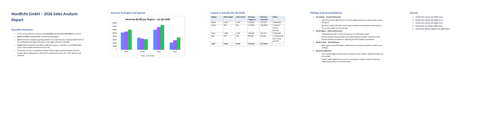
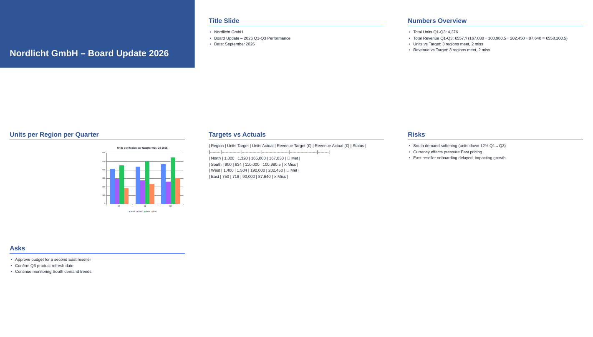
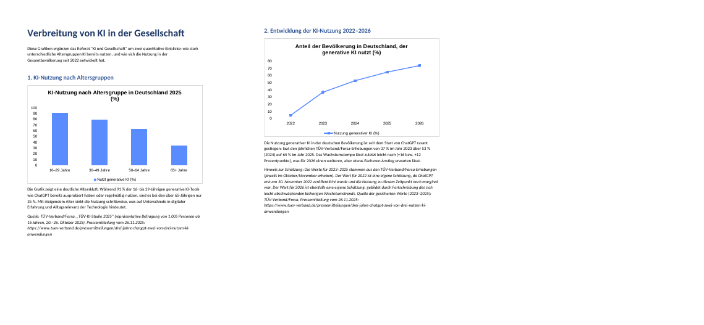
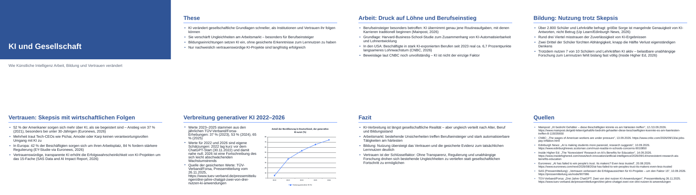

# Release verification — three use cases (2026-09-16)

Branch `feat/release-use-cases`. Question asked: *is the next Desktop version
able to carry three realistic projects end to end, and how does it feel?*

Every use case was **executed for real** against the paired local Synaplan
workspace (`http://localhost:8000`, user `admin`) through the production turn
path of the client (`synaplan_core::agent_tools` — same system prompt, same
tools, same filesystem confinement, same doctor allowlist, same debug log,
same project store). The projects, chats and result files were written into
the running Windows client's own folders, so they are visible in the app:

| Project (Projects switcher) | Folder on this computer | Chat history |
| --- | --- | --- |
| Research: Nordlicht 2026 office files | `C:\Users\user\Synaplan\projects\research-nordlicht-2026-office-files\` | "Merge and analyse the 2026 Nordlicht files" |
| Referat: KI und Gesellschaft | `C:\Users\user\Synaplan\projects\referat-ki-und-gesellschaft\` | "Referat: gesellschaftliche Auswirkungen von KI", "Grafiken und Präsentation" |
| Weekly sales briefing (agents) | `C:\Users\user\Synaplan\projects\weekly-sales-briefing-agents\` | "Week 37 sales briefing" |

Debug log: `%LOCALAPPDATA%\Synaplan\Desktop\logs\desktop-debug.log`
(Settings → Debugging). The agents-run excerpt is in
[`agents-debug-log.txt`](agents-debug-log.txt).

## Where this was run — read before trusting a number

- The model turns, tool calls, skill scripts and file writes ran on this
  machine's WSL side (Linux Python 3.12.3) with the **production core crate**,
  because the Windows executable cannot be driven from the outside. The skill
  scripts are standard-library Python and were additionally executed once
  each with the **Windows** interpreter (`C:\Python312\python.exe`, 3.12.2)
  on Windows paths — write and read of `.docx`, `.xlsx`, `.pptx` all succeed
  there. The Windows box has Node 24 and no LibreOffice; none of the three
  use cases needs LibreOffice.
- Two projects used the workspace's default chat model of the existing test
  project (Groq `openai/gpt-oss-120b`). The student project was switched to
  `anthropic:claude-sonnet-5` after the Groq model failed twice with a raw
  provider error on long tool-call arguments (see findings).
- Rendering checks used LibreOffice 24.2 and `python-docx` / `python-pptx` /
  `openpyxl` as independent readers. Word/Excel/PowerPoint themselves were
  not available here; the packages follow the OOXML schema (masters, layouts,
  theme, relationships, content types) and the independent readers accept
  them. Please open one of each in Office once before shipping.

## Verdict

| Use case | Executable in the new version? | Files well made? | UX |
| --- | --- | --- | --- |
| 1 Research (XLSX/PPTX/DOCX merge, analyse, create) | **Yes** — after this branch. Before it: no (no Office writers, no folder listing, silent 12-step stop). | Good: numbers exact, native charts, tables, sources | Good once the skills are on; the model needs 3 turns and ~35 steps, the run steps are visible in chat |
| 2 Student (fresh web articles, thesis, graphics document, deck) | **Yes** — after this branch (web search did not exist in the client). | Good: real Sep-2026 sources in DE/EN, two native charts with an honest estimation notice, 8-slide deck with sources | Good with Claude; the Web toggle is one click |
| 3 Agents (≥ 4 skills in one request) | **Yes** — 6 skills executed from one message, on the default Groq model. | Good: exact revenue, chart, workbook with totals, memo with chart and recommendations, `.eml`, `.ics` | Good; visible steps; the log answers "what did it do" |

## What had to change to make the use cases pass

Everything below is in this branch, gated by `make ci-local`.

### Skills (all standard-library Python, no `pip`)

| Change | Why |
| --- | --- |
| New **`docx`** skill: Markdown → real `.docx` (title, headings, lists, tables, pictures, native editable charts, page breaks) and `.docx` → Markdown | There was no way to produce a Word file. Reading lets the agent merge existing documents. |
| New **`xlsx`** skill: JSON/CSV → real `.xlsx` (several sheets, styled frozen header, numbers, formulas, SUM total row) and `.xlsx` → JSON/CSV | There was no way to produce or read an Excel file. |
| **`pptx`** rewritten without `python-pptx` (title slide, bullet slides, pictures, native charts, native tables) plus `.pptx` → Markdown | The old skill was **blocked on this Windows PC** (`python-pptx` missing, the app never runs pip). |
| Bundled skills now **refresh on update** when the on-disk copy is untouched; edited copies are kept, pre-fingerprint copies are backed up as `*.before-update` | Existing installs would have kept the blocked `pptx` forever. |
| `email-draft` accepts `--body-file` and decodes `\n` / `%0A` | The model passed URL-encoded newlines; the draft body was one line of `%0A`. |

### Agent runtime (`synaplan-core`)

| Change | Why (observed in the runs) |
| --- | --- |
| New `list_files` tool (confined to readable folders, hides denied entries) + system-prompt rule "list first, never guess a file name" | First run: the model guessed `Q1.xlsx`, got "blocked by the sandbox", then tried `ls -R`. |
| Step budget 12 → 40, and an **honest wrap-up answer** when it is reached | First research turn ended after 12 steps with an *empty* answer and no merged workbook. |
| `max_tokens` 4096 → 8192, and a round that ends in `max_tokens` is **not executed** (the truncated tool call would write an empty file); the model is asked to continue | Student run: `quellen.md` was written empty and the turn ended mid-sentence. |
| Only `text` and `tool_use` blocks are echoed back to the model | Anthropic rejected replayed `web_fetch_tool_result` blocks the gateway had handed to the client. |
| A server tool (`web_search`) requested in the same step as a client tool gets a tool error "call it alone" | The gateway returns mixed steps verbatim; the client cannot run `web_search`. |
| Tool errors say what to do: "Own scripts cannot run — use a skill's run.py", "File not found — use list_files", "Path not allowed or not found" | The model wrote `aggregate.py` into the out-box and burned steps on "blocked by the sandbox". |
| The project folder is a **read root** for the project's turns (write stays `out/`) | The research sources live in the project folder; before, only the out-box and added folders were readable. |
| **Doctor bug**: `/usr/bin/python3` was treated as the macOS CLT stub on *every* OS, so on Linux the doctor reported "Python missing" and blocked all skills | Found because the first run logged `skills=[]`. Windows and macOS were not affected. |
| Tool/prompt/dispatch code moved from the Tauri shell into `synaplan_core::agent_tools` | It is Tauri-free business logic; now unit-tested and reusable by the poll loop and this verification. |

### Client features

| Change | Where |
| --- | --- |
| **Web search per project** — `🌐 Web` toggle in the chat composer, off by default, persisted on the project; declares the gateway's server tool for plain chat and skill turns, adds a citation rule to the system prompt | `ChatView.vue`, `Project.web_search`, `agent::web_search_tool()` |
| **Debug log** — Settings → Debugging: "Write a debug log on this computer", file path with *Show in folder*; records turn start/end (project, model, skills, exec, web), every tool start/end (paths, commands, results, artifacts), errors, uploads, skill toggles. Never the key, messages or file contents; redacts `sk_…`; rotates at 5 MB | `SettingsView.vue`, `debuglog.rs`, `config.debug_log` |
| Start screen "What can I do here": **5 tiles** (was 3) — the two new examples are **Write a Word document** and **Build an Excel workbook**; a PowerPoint card exists for the chooser | `useTaskStudio.ts`, `TaskStudio.vue`, five locales |

## Use case 1 — Research: Nordlicht 2026 office files

**Setup.** Project with skills `docx, xlsx, pptx, csv-insights, chart`. Five
source files in `<project>\sources\`: three quarterly workbooks
(`nordlicht-sales-q1..q3-2026.xlsx`, 4 regions × units/revenue/rep, total
row), the strategy document (`.docx`, targets table + priorities) and the Q1
board deck (`.pptx`). The same five files were also added to the project's
knowledge folder (Files view path), so plain chat can ask about them.

**Turn 1** — "read all five, merge the three workbooks into one with a
Summary sheet". Steps: `list_files` ×2, `xlsx read` ×3, `docx read`,
`pptx read`, `write_file merged_spec.json`, `xlsx write`.
Result `nordlicht-2026-merged.xlsx`: sheets `Summary, Q1 2026, Q2 2026, Q3 2026`.
Summary checked against the sources — every cell correct, e.g. North units
412 + 438 + 470 = **1320**, East revenue 21 900 + 28 750 + 36 990 = **87 640**,
totals 4 376 units / €558 100.50.

**Turn 2** — analysis against the strategy targets → `nordlicht-2026-analysis.docx`
(executive summary, native bar chart revenue per region and quarter, table
targets vs actuals with status, findings, sources). Correct reading: North and
West above target, South and East below, East grew most (+68 % Q1→Q3).

**Turn 3** — board deck → `nordlicht-2026-board-update.pptx`, 7 slides with a
native chart and a table.

**UX assessment.** Nice and easy once the skills are on: drop the files in the
project folder (or add them under Files), ask in plain language, watch the
steps, click the artifact cards. Rough edges seen:

- The first version of the deck put a Markdown table on a slide as raw `|`
  text and added a redundant "Title Slide" — fixed in the `pptx` skill
  (native tables; "Title slide" heading is folded into the title slide).
- A "two-page" request became five pages (charts and tables take room); the
  skill has no page-length control — acceptable, note in the docs.
- Groq `gpt-oss-120b` once produced a truncated number ("€557,?") on a slide.

## Use case 2 — Student: social impact of AI (German)

**Setup.** Project "Referat: KI und Gesellschaft", skills `docx, pptx,
web-report, chart`, **Web on**, model Claude Sonnet.

**Turn 1** — six current articles (DE/EN) → `quellen.md` (7 KB): Mainpost
(12–13 Sep 2026), CNBC 13 Sep 2026, Edinburgh News 10 Sep 2026, Inside Higher
Ed 14 Sep 2026, Euronews 20 Aug 2026, pressemitteilung.ws. Checked: CNBC,
Inside Higher Ed and Mainpost URLs return 200; Scotsman and Euronews answer
403/406 (bot protection on real pages). The web search ran on the workspace
(Brave) — invisible to the client, which is expected.

**Turn 2** — thesis + summaries → `these-und-zusammenfassungen.docx`.

**Turn 3** — graphics document → `ki-adoption-grafiken.docx` with two native
charts (bar: AI use by age group 2025, TÜV/Forsa; line: share using generative
AI 2022–2026) and, as requested, an explicit *"Hinweis zur Schätzung"* naming
which values are estimates and where the real ones come from.

**Turn 4** — `referat-ki-gesellschaft.pptx`, 8 slides: title, thesis, Arbeit,
Bildung, Vertrauen, chart slide, Fazit, Quellen with URLs.

**UX assessment.** The `🌐 Web` toggle is discoverable and honest about what
leaves the computer. The student never sees a search result list — only the
cited answer — which is what a presentation writer wants. Two turns had to be
re-run during this test because of the runtime bugs listed above (empty file
on `max_tokens`, replayed server blocks); both are fixed.

## Use case 3 — Agents: weekly sales briefing (six skills, one request)

**The use case.** Monday morning. A regional sales lead has the week's
transactions as `sales-week-37.csv` in the project folder (97 rows: date,
region, rep, product, units, revenue, channel). One message asks for the
whole briefing pack. Six local skills run on this computer, nothing leaves it
except the chat with the model:

1. `csv-insights` → `sales-week-37-insights.md` (profile of the CSV)
2. `chart` → `region-revenue-chart.html` (bar chart, revenue per region)
3. `xlsx` → `week-37-sales.xlsx` (sheet `RawData`, sheet `ByRegion` with a SUM total row)
4. `docx` → `week37-briefing.docx` (key numbers, native chart, three recommendations)
5. `email-draft` → `week37-sales-email.eml` (unsent, opens in Outlook as a draft)
6. `calendar-event` → `week37-review.ics` (Wed 16 Sep 2026 10:00–10:45)

Checked against the CSV: total revenue **€67 119.50 exact**, best region West
€26 501.80 exact, best product Nordlicht Lamp L correct; total units 723 vs
724 (the model added by hand — see follow-ups).

**What the log shows** ([`agents-debug-log.txt`](agents-debug-log.txt), 47
lines for the run): the turn header with model, the seven enabled skills,
`exec=true web=false`; `list_files` on the project folder; the SKILL.md reads;
`csv-insights` run; the model writing its own `aggregate_region_revenue.py`
and the sandbox refusing it (`ok=false summary="Own scripts cannot run — use a
skill's run.py"`); the six `run_program` lines with the exact commands and the
artifact each produced; `turn done`. This is the file to attach to a bug
report.

**Why this is useful on Windows.** Every result is a normal file in
`C:\Users\user\Synaplan\projects\weekly-sales-briefing-agents\out\`: the
`.xlsx` and `.docx` open in Office, the `.eml` opens in Outlook as an editable
draft (`X-Unsent: 1`), the `.ics` adds the meeting with a double-click, the
chart opens in the browser. No installer, no pip, no shell — the client only
runs `C:\Python312\python.exe <skill>\run.py <files>` with paths confined to
the project folder and its out-box.

## Findings that remain (follow-ups, not blockers)

1. **Gateway (synaplan repo):** when a step mixes a server tool (`web_search`)
   with client tools, the gateway returns the step verbatim and the client
   cannot serve the server tool. The client now steers the model to retry
   alone; the cleaner fix is server-side (execute native tools, return only
   client calls). Also: provider errors reach the user raw ("Parsing failed.
   The model generated output that could not be parsed…", "Failed to parse
   tool call arguments as JSON").
2. **Groq `gpt-oss-120b`** is flaky on long tool-call JSON (two hard failures
   in five runs). Claude Sonnet completed every turn. Consider recommending a
   stronger default chat model for skill-heavy projects on the Models page.
3. **Arithmetic by the model**: totals came from the model, not from code
   (723 vs 724). A small `aggregate` mode in `csv-insights` (group-by, sum)
   would make every number come from Python.
4. `pptx`: no speaker notes; `calendar-event`: floating local time, no TZID;
   `docx`: no page-length control.
5. Notes on the Windows exe: the projects and chats created here appear after
   the client reloads its project list; the debug log path in Settings points
   to the same `logs\desktop-debug.log` this run wrote.

## Post-merge review on `main` (16 Sep, evening)

PR #25 (this work) and PR #24 (image handling, chat artifacts) were merged
the same afternoon. #24 put a *generation classifier* in front of every
send — including skill turns — which did not exist when the runs above were
made. Checking the merged `main` against the prompts of the three use cases
and the five start-screen tiles found, and fixed:

| Found on merged `main` | Effect | Fix |
| --- | --- | --- |
| `Write a Word document…`, `Build an Excel workbook…`, `Make a PowerPoint deck…` tiles classified as `document` | The assistant's first reply is a question back; it was saved as a `.md` document and uploaded — "Saved this document in the project." | Replies are kept as a document only on plain chat turns, and never when the last line is a question |
| "Create a bar chart **image** of …" classified as `image` | Sent to the image model (error without one, a painted picture with one) instead of the chart/docx skills | Chart, diagram, graph, Grafik, Diagramm … are data, never a picture request (Rust + TS mirror, tests) |
| Classifier error dropped the message | The user's text was gone, an error banner shown | Falls back to a plain chat turn |
| `convertFileSrc` previews without the asset protocol | Generated image/audio/video previews could not load in the built app | `protocol-asset` feature + `assetProtocol` scope on `$HOME/Synaplan/projects/*/out/**` |
| `"` in a sheet name / image caption / shape name | Malformed `workbook.xml` / `document.xml`; Office refuses the file | Attribute-aware escaping in `xlsx`, `docx`, `pptx` |
| Debug log wrote `run_program command="…"` verbatim | The full email body of the agents run is in `agents-debug-log.txt` — contrary to the Settings hint | Log line is `program=… script=… args=N`; test locks it in |
| A rerun that rewrites `report.docx` | Only *new* paths were published to the workspace; the workspace copy stayed stale | Snapshot by size + mtime; `written_files` in the tool result |
| "Five starting examples" / "1 skills ready" | Copy promised five while a project with one enabled skill shows one tile; wrong plural | Count-neutral lead, plural forms, five locales |
| Groq invented `repo_browser.open_file` | Replaying that `tool_use` made the next request fail: "not in request.tools". The agents walk died after `list_files`. | Drop undeclared `tool_use` on replay, nudge the model with the real names (`echo_declared_blocks`) |

The in-app walk (type → watch the steps → find the file → open it) was
run on the Windows executable the same evening. Start it with a
dev-only config override that adds `--remote-debugging-port=9222` to
the WebView2 arguments (`./start-windows.ps1 '--' '--config'
<override.json>`, nothing in the repo changes) and drive clicks from a
Windows `node`. Evidence:
[`windows-evening-debug.log`](windows-evening-debug.log),
[`windows-agents-files.png`](windows-agents-files.png).

### Windows executable walk (16 Sep, 19:29–20:14)

The running app is the Windows `synaplan-desktop.exe` (WebView2,
`C:\Python312\python.exe`, skills under `%LOCALAPPDATA%\Synaplan\Desktop\skills`).
Debug log timestamps below are UTC.

| Time (UTC) | What happened |
| --- | --- |
| 17:29 | First research send: skills were readable (trusted-root fix), but `python3` / `python` both exited **9009** — the doctor had accepted the Store alias. |
| 17:33 | Relaunch with the doctor fix (`a67621f`). |
| 17:35–17:36 | **Research** on Windows: `list_files` on the project and `sources\`, `xlsx` read of Q1–Q3, `docx` write → `nordlicht-q1-q3-summary.docx` (valid OOXML, native chart). One invented `repo_browser.read_file` was logged as unknown and the turn continued. |
| 17:38–17:43 | **Student** on Windows, Web on, Claude: wrote `quellen-update.md` with three Sep-2026 articles (CNBC Goldman, ZEIT, Randstad/Leadersnet) and URLs. |
| 18:03 | **Agents** first send died after `list_files`: Groq called `repo_browser.open_file`, the next `/v1/messages` was rejected (`not in request.tools`). |
| 18:08 | Relaunch with the replay filter (invented `tool_use` is dropped, the model is told the real names). |
| 18:13 | **Agents** second send, one prompt, Groq `gpt-oss-120b`, 7 skills ready, ~50 seconds. |

Agents turn 18:13 produced, on this computer:

| File in `weekly-sales-briefing-agents\out\` | Skill |
| --- | --- |
| `sales-week-37-insights.md` | csv-insights |
| `region-revenue-chart.html` | chart |
| `week-37-sales.xlsx` | xlsx (valid workbook; this run wrote one sheet — the ByRegion spec was saved beside it) |
| `week37-briefing.docx` | docx (valid OOXML, native chart) |
| `week37-sales-email.eml` | email-draft (`X-Unsent: 1`, To: team@nordlicht.example) |
| `week37-review.ics` | calendar-event (`DTSTART:20260916T100000`–`104500`) |

Key numbers in the memo match the CSV (`revenue_eur` / `units`):
**€67,119.50**, **724 units**, West **€26,501.80**. (The afternoon harness
run had 723 units — that was the model adding by hand. This Windows run
got the unit count right.)

The chat listed every artifact as a card. The Files pill went from 0 to
**7 files**; each row has **Show in folder**. One red step remains
(`Unknown tool repo_browser.read_file`) and no longer aborts the turn.

### Still uncommitted on `main` after this walk

The replay filter that unblocked 18:13 (`echo_declared_blocks` +
`unknown_tool_nudge` in `synaplan-core::agent`, plus a system-prompt
line that there is no `repo_browser`) is in the working tree and is
**not committed yet**. The two Windows fixes already on `main`
(`0452c19` trusted skills folder, `a67621f` Store-python doctor) are
committed and **2 commits ahead of `origin/main`**.

## Files in this folder

- `transcript-research.md`, `transcript-student-part1.md`,
  `transcript-student-part2.md`, `transcript-agents.md` — user prompt, steps,
  assistant answer per turn.
- `agents-debug-log.txt` — the debug log of the agents run (skills folder and
  project folder shortened to `<skills>` / `<project>`).
- `*.png` — LibreOffice renders of the produced Office files.
